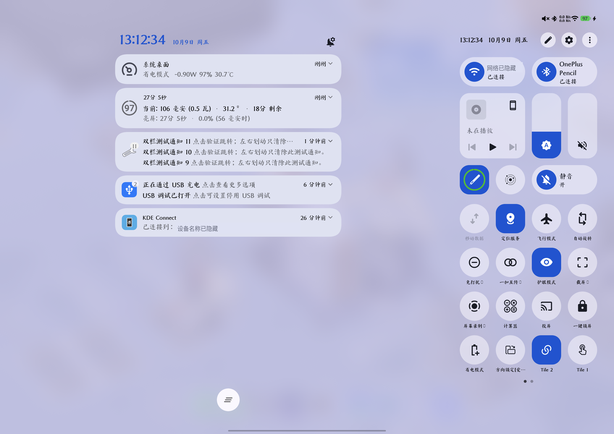

# OneShade

**OPD2413 双栏控制中心：通知与快捷设置，同屏显示。**

[](https://github.com/FFDVDGD/OneShade/actions/workflows/build.yml)
[](https://github.com/FFDVDGD/OneShade/releases/latest)

OneShade 是 LSPosed 模块。在解锁、横屏、通知与控制中心分离模式下，左侧显示真实通知，右侧保留原生 ColorOS 控制中心。应用显示名称为“平板双栏控制中心”，包名为 `io.github.opd2413.ctrlcenter`。



截图来自 0.4 的原生动画验证，已遮挡设备名称与 Wi-Fi 名称；0.4.1 保留相同布局和动画。

## 功能

- 顶部左右任一侧下拉，同屏显示通知和控制中心。
- 原生通知点击、划除、通知组展开和列表滚动，不复制通知数据。
- 左侧通知保持原生宽度，按右栏边界在可用空间居中。
- 两侧空白可轻点或上滑关闭；控制中心按钮保持原生交互。
- 两栏联动启动原生动画，保留各自的卡片／开关弹簧和回弹，不强制逐帧相同。
- 隐藏左侧重复状态图标，保留时钟、通知设置按钮及右侧图标。
- 竖屏、锁屏及关闭分离模式时不启用双栏。

不需要通知读取权限，没有悬浮窗或常驻服务，不替换系统 APK，也不改变其他模块的配置。

## 兼容性与风险

**只适配下列实测环境，不是通用 OnePlus / ColorOS 模块。**

| 项目 | 实测值 |
| --- | --- |
| 设备型号 | OPD2413 |
| 系统 | Android 16 / API 36，ColorOS 16.1 |
| 固件 | `OPD2413_16.0.9.400(CN01)` |
| SystemUI | `16.99.12` / versionCode `169912` |
| 框架 | LSPosed IT `2.1.1-it (7789)` |
| Root | KernelSU |

代码检查型号、API 和 SystemUI versionCode。其他设备或版本不启用双栏；升级固件后不要删除保护来强行使用。

已知限制：

- 极快速收起后立即重拉，可能被原生关闭阶段忽略，留在桌面。
- 同步的是启动意图，两栏原生曲线及结束时刻并不完全相同。
- ColorOS 自动合并通知的行为保持原样。
- 未覆盖其他固件、全部通知类型、所有连续／反向手势、与所有 Root 模块的组合及整机重启后的长期稳定性。

修改 SystemUI 私有行为仍可能导致界面异常。**安装前保持已授权 USB ADB 和可用 Root 恢复路径。** 去掉开发期名称标记不表示消除了上述风险。

## 下载与安装

1. 从 [GitHub Releases](https://github.com/FFDVDGD/OneShade/releases/latest) 下载正式签名的 `OneShade-v*.apk`；同页提供 `SHA256SUMS`。
2. 安装后，在 LSPosed 启用“平板双栏控制中心”，**作用域只勾选系统界面 `com.android.systemui`**。
3. 保存当前操作，重载 SystemUI；如果回到锁屏，正常解锁。
4. 横屏并打开系统的通知／控制中心分离模式，从顶部任一侧下拉。

模块没有桌面入口。在 LSPosed 或系统应用信息页查看名称和版本。

ADB 安装示例：

```sh
adb devices -l
SERIAL='<目标 OPD2413 的 ADB 序列号>'
adb -s "$SERIAL" shell getprop ro.product.model
adb -s "$SERIAL" install -r OneShade-v0.4.1.apk
adb -s "$SERIAL" shell 'su -c "kill $(pidof com.android.systemui)"'
```

官方 0.4.1 使用正式证书，并携带此前本地开发签名的 Android 证书轮换证明；在目标平板上已无需卸载覆盖更新。其他人自行编译的 APK 可能签名不同；出现 `INSTALL_FAILED_UPDATE_INCOMPATIBLE` 时不要绕过签名验证。若选择卸载旧包重装，需要重新确认本模块启用状态和作用域。

## 恢复原状

优先在 LSPosed 关闭本模块，再重载 SystemUI。界面无法使用而 USB / Root 仍可用时：

```sh
./scripts/recover-device.sh "$SERIAL"
```

脚本要求显式指定设备，先检查型号，随后只卸载 `io.github.opd2413.ctrlcenter` 并重启 SystemUI；不会停用 LSPosed、卸载其他模块或清空用户通知。该路径要求已有 ADB 授权和可用 Root，不能保证在所有系统故障中可达。

## 构建与开发文档

推荐 JDK 21，Android SDK 36；源码级别为 Java 17。使用仓库自带 Gradle Wrapper：

```sh
./gradlew :app:assembleDebug :app:assembleRelease :app:lintDebug :app:lintRelease
```

debug APK 使用本地 debug 签名，包含由 DUMP 权限保护的通知测试 Activity；release 产物默认未签名，正式发布时签名，不含测试组件。CI 的未签名 APK 不是可安装的 GitHub Release 包。

- [完整开发文档](docs/DEVELOPMENT.md)：工程、Hook 表、调用关系、状态协调、原生动画、布局、触摸路由、新固件适配、签名及发布。
- [实机验证与排查](docs/TESTING.md)：安全准备、通知 fixture、测试矩阵、高帧率录屏、已有证据、未覆盖项及恢复步骤。
- [更新记录](CHANGELOG.md)。

0.4 的实机基准中，10 次左右交替开合均显示两栏，通知点击／划除／滚动、两侧空白手势及设置按钮通过。0.4.1 不改控制中心源码，另验证了正式 APK 的构建、签名、覆盖安装、名称及 SystemUI 重载后的双栏功能。CI 不替代实机验证。

## 调研与许可说明

调研过 LuckyTool 和 [Oxygen Customizer](https://github.com/DHD2280/Oxygen-Customizer)。后者提供 Oplus Hook 参考，本项目的具体私有 API 与逻辑以实测设备为准，没有直接移植完整模块。系统自带 split shade 与厂商平板分离页互斥策略，使单改资源布尔值不足以实现目标。

不分发厂商 APK、反编译源码或个人通知资料。仓库自身尚未指定开源许可证；第三方原有许可声明保留，详情见开发文档。
